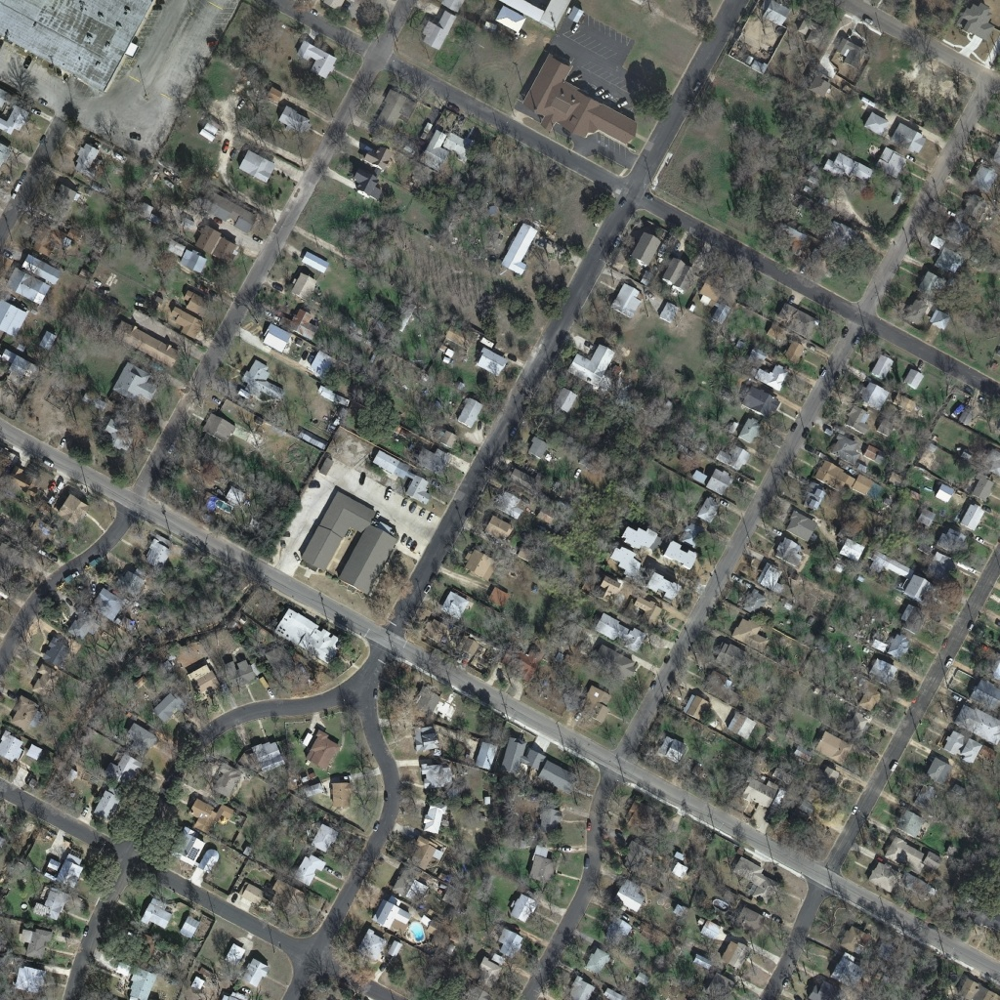
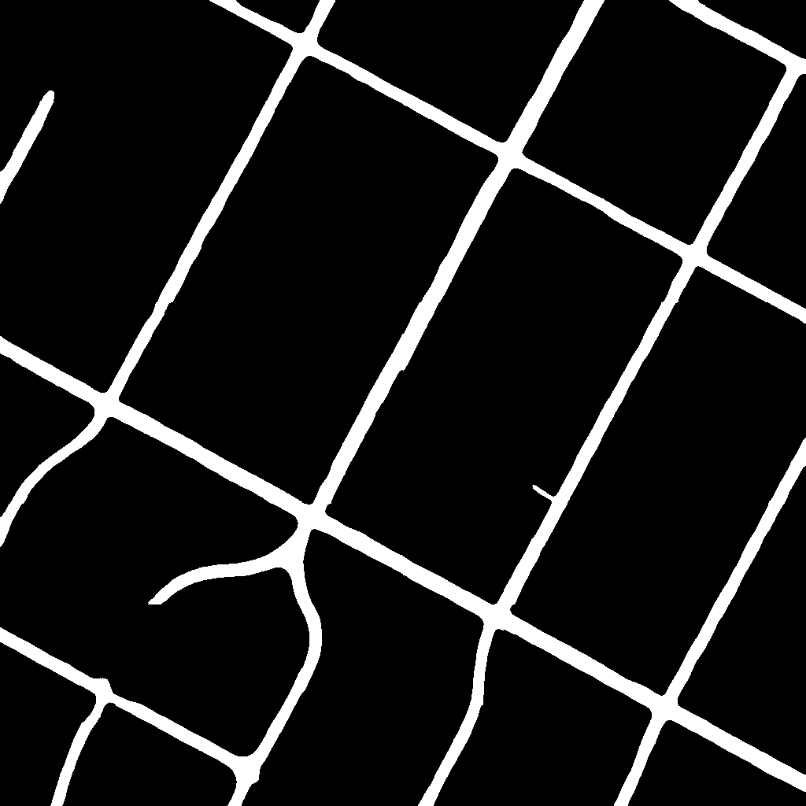
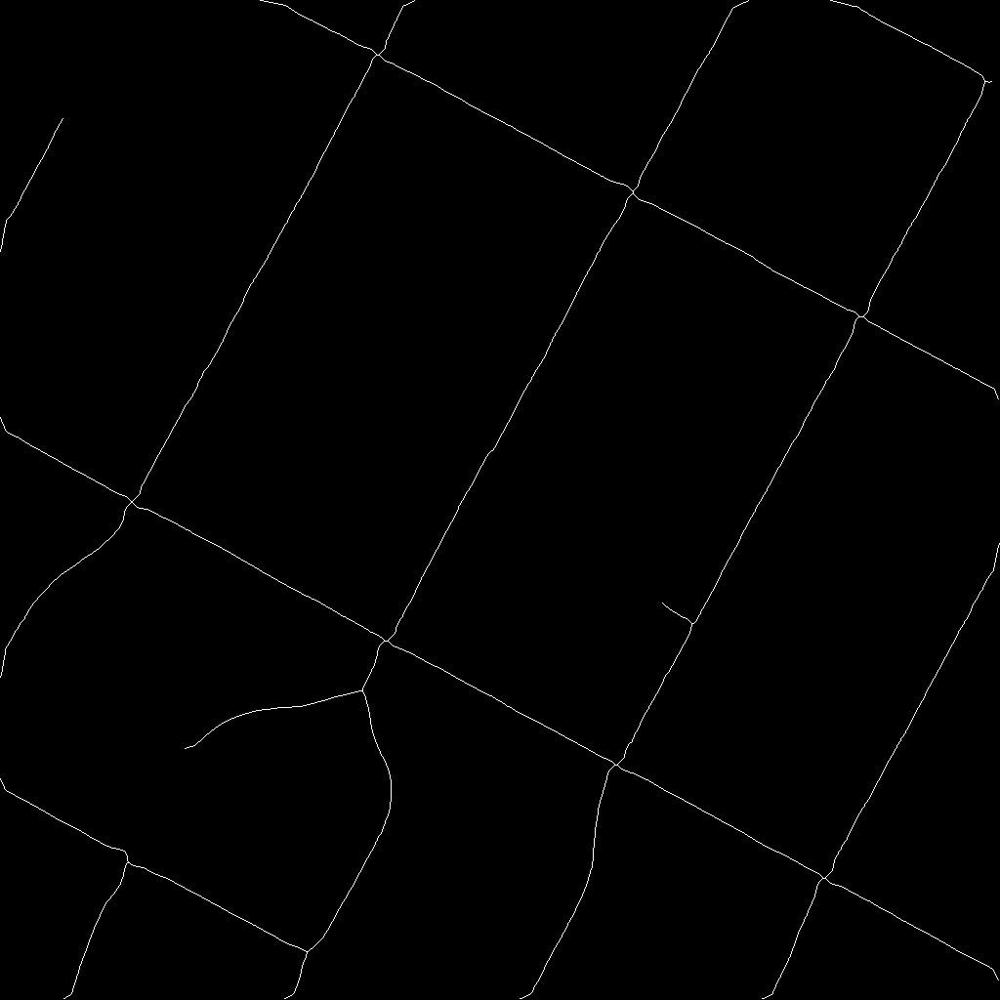

# Sanchari

State-of-the-art Road Segmentation pipeline for satellite imagery, powered by Deep Learning.

## Overview

Sanchari V3 is a robust deep learning solution designing to extract road networks from high-resolution satellite imagery. It utilizes a **ResNet34-UNet** architecture, advanced **Test Time Augmentation (TTA)**, and morphological post-processing to deliver high-accuracy road masks and **GeoJSON vectors**.

This repository contains the complete pipeline:
*   **Preprocessing**: Automated tiling and data preparation.
*   **Training**: PyTorch-based training loop with Dice Loss and Cosine Annealing.
*   **Inference**:
    *   **Batch**: Process folders of images.
    *   **API**: Fast API endpoint for real-time inference on GeoTIFFs.
*   **Optimization**: Tools to find the perfect probability threshold.

---

## The Journey: V1 to V3

This project has evolved significantly to address the challenges of satellite imagery analysis.

| Feature | V1 (Legacy) | V3 (Current) | Why the change? |
| :--- | :--- | :--- | :--- |
| **Model** | Simple U-Net (Custom) | **ResNet34 Pre-trained U-Net** | Transfer learning from ImageNet (ResNet34) provides much better feature extraction and faster convergence than training from scratch. |
| **Inference** | Simple Patching | **Sliding Window + TTA** | Simple patching led to "grid artifacts" at edges. Sliding window with overlap + TTA eliminates edge seams and boosts accuracy. |
| **Loss** | BCE Loss | **Dice Loss** | Roads are sparse (imbalanced classes). Dice Loss directly optimizes overlap, preventing the model from just predicting "background" everywhere. |
| **Output** | Binary Masks | **GeoJSON Vectors** | Masks are pixels; Vectors use latitude/longitude. V3 generates structured LineStrings ready for GIS tools (QGIS, Mapbox). |
| **Post-Process**| None | **Morphology & Skeletonization**| Raw predictions are noisy. V3 cleans noise, closes gaps, and extracts road centerlines. |

---

## Project Structure

*   **/geotiffs**: Place your source GeoTIFFs here for API inference.
*   **/weights**: Stores trained model weights (`best_model_v3.pth`).
*   **/test-images**: Input images for batch inference testing.
*   **/data**: Stores raw and processed training datasets.
*   **Key Scripts**:
    *   `model_v3.py`: Defines the ResNet34-UNet architecture.
    *   `train_v3.py`: Main training script.
    *   `preprocess_v3.py`: Downloads DeepGlobe dataset and tiles it.
    *   `predict_v3.py`: Runs batch inference on images.
    *   `main_v3.py`: **API Server** for handling GeoTIFF requests.
    *   `check_coords.py`: Utility to inspect GeoTIFF metadata.
    *   `optimize_threshold_v3.py`: Finds the best probability threshold.

---

## Setup Guide

### 1. Local Installation

**Prerequisites:** Python 3.9+, NVIDIA GPU (Recommended)

1.  **Clone the Repository**:
    ```bash
    git clone https://github.com/yourusername/sanchari-model.git
    cd sanchari-model
    ```

2.  **Install Dependencies**:
    ```bash
    pip install -r requirements.txt
    ```

### 2. Google Colab / Kaggle Setup (For Training)

If you don't have a local GPU, Google Colab is the best place to train.

**Step 1: Setup Kernel**
*   Open [Google Colab](https://colab.research.google.com/).
*   New Notebook -> Runtime -> Change runtime type -> **T4 GPU**.

**Step 2: Clone & Install**
```python
!git clone https://github.com/yourusername/sanchari-model.git
%cd sanchari-model
!pip install -r requirements.txt
```

**Step 3: Setup Kaggle API (Crucial for Data)**
*   Go to your [Kaggle Account](https://www.kaggle.com/account) -> Create New API Token -> Downloads `kaggle.json`.
*   Upload `kaggle.json` to Colab root.
```python
!mkdir -p ~/.kaggle
!cp /content/kaggle.json ~/.kaggle/
!chmod 600 ~/.kaggle/kaggle.json
```

**Step 4: Run Preprocessing**
*   This script automatically downloads the **DeepGlobe Road Extraction Dataset** and tiles it into 256x256 chips.
```python
!python preprocess_v3.py
```

**Step 5: Train**
*   Start training (50 epochs by default).
```python
!python train_v3.py
```
*   Once done, download `weights/best_model_v3.pth`.

---

## Usage

### 1. Train the Model
```bash
python train_v3.py
```
*Training logs are saved to `training_log_v3.csv`.*

### 2. Optimize Threshold
Find the exact probability cutoff (e.g., 0.42 instead of 0.5) that maximizes IoU on your specific data distribution.
```bash
python optimize_threshold_v3.py
```

### 3. Batch Inference (Testing)
Run the model on a folder of images (`test-images/`) to see visuals.
```bash
python predict_v3.py --input test-images --output predictedv3
```
*Outputs: Probability Map, Binary Mask, Road Skeleton, and Overlay.*

### 4. API Server (GeoTIFFs)
Serve the model to answer coordinate queries (Lat/Lon) from a frontend.
```bash
# Start Server with Debug output enabled
python main_v3.py --debug
```
**Test with cURL:**
```bash
curl -X POST "http://localhost:8000/predict" \
     -H "Content-Type: application/json" \
     -d '{"latitude": 30.2241, "longitude": -97.7816}'
```
*Response: GeoJSON FeatureCollection of road centerlines.*

---

## Model Architecture Details

### V3 Architecture: ResNet34-UNet
*   **Encoder**: **ResNet-34** (pre-trained on ImageNet). Extracts deep semantic features (textures, shapes) at multiple scales.
*   **Decoder**: **U-Net** style upsampling with **skip connections**. Fuses high-level semantic info with low-level spatial details from the encoder to produce sharp masks.
*   **Activation**: Sigmoid (outputs 0-1 probability per pixel).

### Post-Processing Pipeline
1.  **TTA (Test Time Augmentation)**: We predict on the image, flip it horizontally, flip vertically, and rotate 90°. We average the 4 results. This removes direction bias.
2.  **Thresholding**: Applied at optimized level (default 0.45).
3.  **Morphology**:
    *   `remove_small_objects`: Deletes isolated noise pixels.
    *   `closing`: Connects small gaps in invalid road segments.
4.  **Skeletonization**: Thins the road to a 1-pixel wide line for vectorization.

---

## Examples

| Input | Probability | Detected Mask | Skeleton |
| :---: | :---: | :---: | :---: |
|  |  |  |  |

---

## 🤝 Contributing

We welcome contributions!
1.  Fork the repo.
2.  Create a feature branch (`git checkout -b feature/AmazingFeature`).
3.  Check your changes (`python test_v3.py` ensures everything is effectively tested).
4.  Commit and Push.
5.  Open a Pull Request.

## 📄 License

Distributed under the MIT License. See `LICENSE` for more information.
