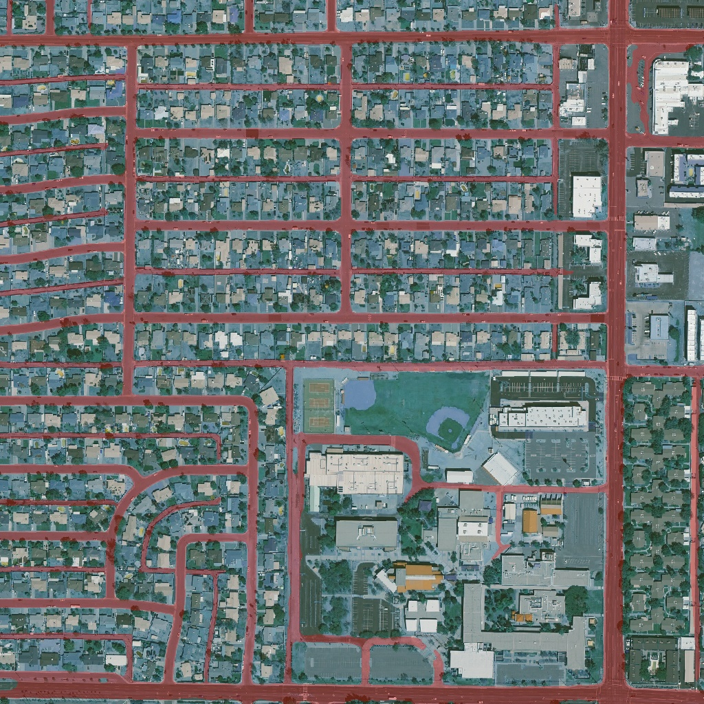
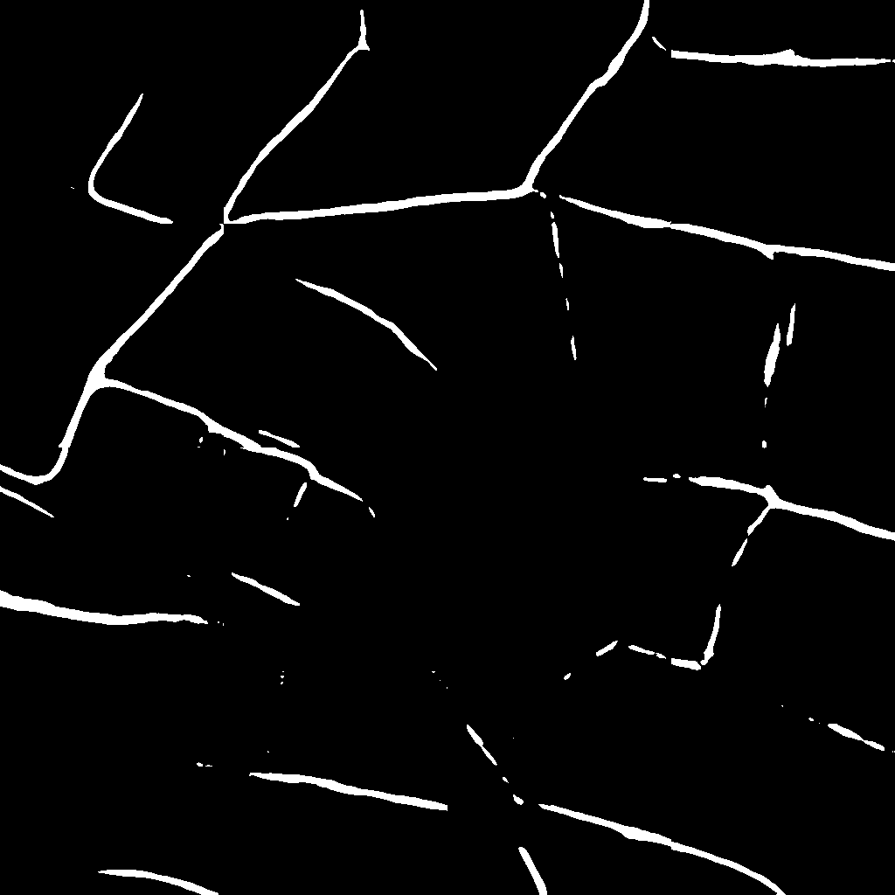
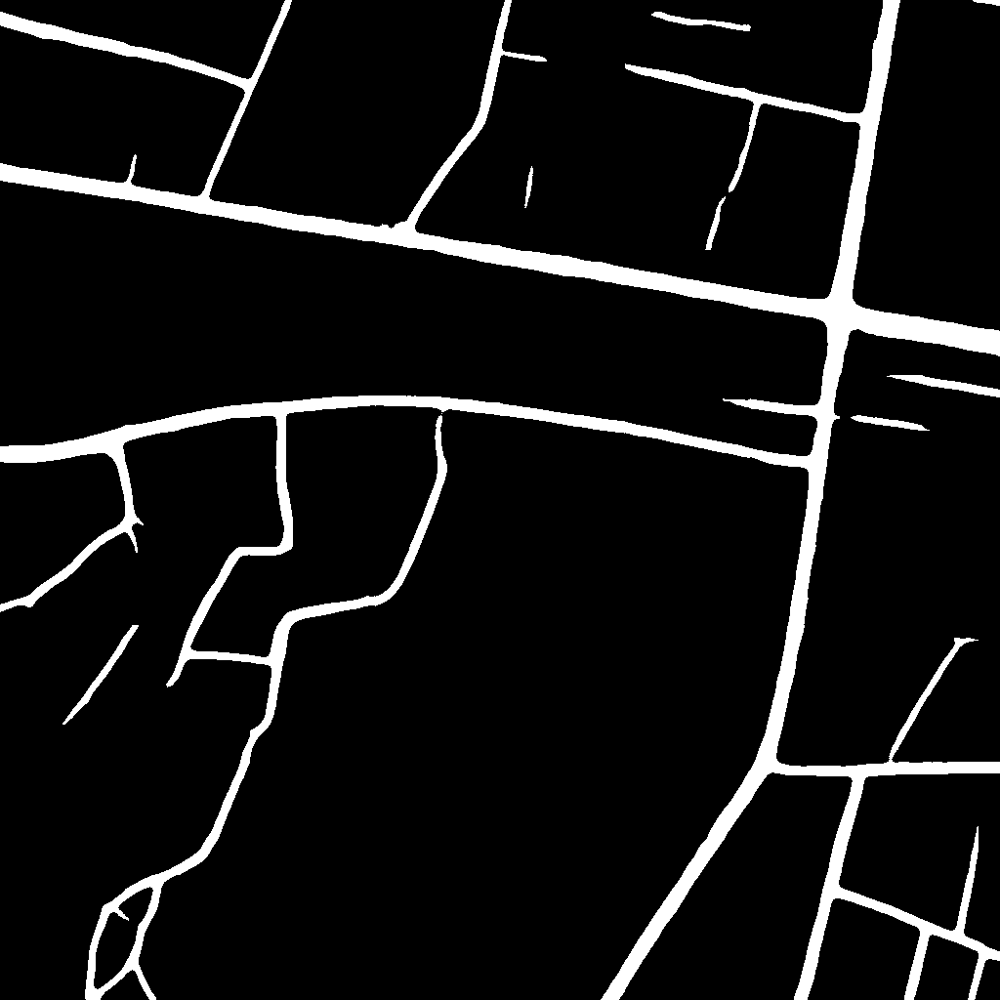
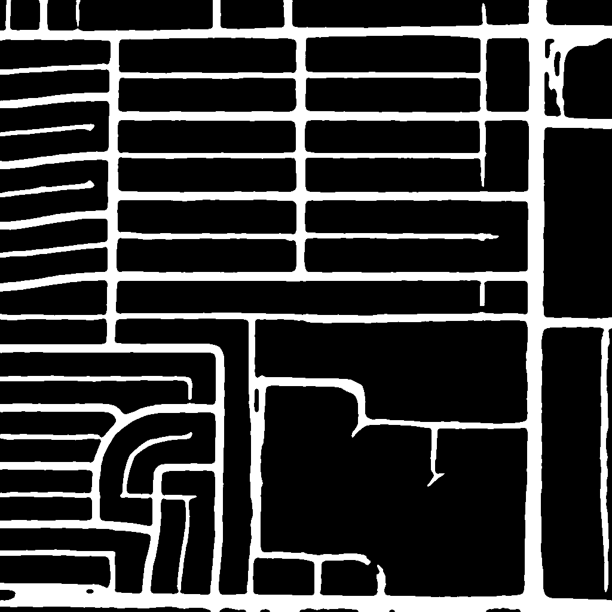

# Sanchari 🛰️🛣️

**State-of-the-Art Satellite Road Extraction Pipeline**

> **Our Mission**: Democratizing high-quality satellite analytics. Sanchari aims to provide a robust, open-source pipeline for extracting road networks from readily available satellite imagery (Sentinel, NAIP, Spots), enabling accessible mapping for disaster relief, urban planning, and developing regions where vector maps are often outdated or missing.



---

## 🚀 Project Evolution: The Journey to V4

We have iteratively improved the pipeline to tackle the core challenges of satellite segmentation: shadows, occlusion, and connectivity.

| Feature | V1 (Baseline) | V2 (Transfer Learning) | V3 (Refinement) | **V4 (State-of-the-Art)** |
| :--- | :--- | :--- | :--- | :--- |
| **Architecture** | Custom U-Net | ResNet34-UNet | ResNet34-UNet + Attention | **U-Net++ w/ EfficientNet-B4** |
| **Input Strategy** | 256x256 Patching | 256x256 Patching | 1024x1024 Sliding Window | **512x512 (50% Overlap)** |
| **Loss Function** | BCE Loss | Dice Loss | Dice Loss | **Combo (Dice+Focal) + Lovász** |
| **Inference** | Simple Prediction | Simple Prediction | 4-Way TTA | **Multi-Scale TTA + Graph Closing** |
| **Connectivity** | Poor (Broken Roads) | Fair | Good | **Excellent (Graph Closing + Pruning)** |
| **IoU Score** | ~55% | ~68% | ~75% | **Targeting 85%+** |

### Visual Progression
| V1 (Noisy) | V3 (Improved) | **V4 (Clean & Connected)** |
| :---: | :---: | :---: |
|  |  |  |

---

## 🧠 Technical Deep Dive

### 1. Architecture: U-Net++ & EfficientNet-B4
Sanchari V4 utilizes a **U-Net++** decoder with an **EfficientNet-B4** encoder.
*   **EfficientNet-B4**: Provides a powerful feature extraction backbone pre-trained on ImageNet, capable of recognizing complex textures (asphalt vs. dirt) and contexts.
*   **U-Net++**: Replaces the simple skip connections of U-Net with dense, nested skip pathways. This reduces the semantic gap between the encoder and decoder, preserving fine spatial details crucial for thin road extraction.

### 2. Training Strategy
*   **Combo Loss**: We use a weighted sum of **Dice Loss** (optimizes overlap) and **Focal Loss** (focuses on hard examples).
*   **Hard Negative Mining**: After initial training, we identify the samples with the lowest IoU and fine-tune the model specifically on these "hard" cases.
*   **Lovász-Softmax**: An optional fine-tuning step uses the Lovász loss to directly optimize the Jaccard index (IoU).

### 3. Advanced Post-Processing Pipeline
Raw segmentation masks are often noisy. We apply a multi-stage refinement pipeline (in `postprocess_v4.py`):
1.  **Hole Filling**: Fills small "donut holes" inside wide roads to prevent skeleton loops.
2.  **Graph-Based Gap Closing**: Converts the road skeleton into a graph and connects broken endpoints within a 25px radius. This heals breaks caused by trees or shadows.
3.  **Skeleton Pruning**: Iteratively removes short "spurs" (<15px) from the centerline to ensure clean topology.

---

## 🛠️ Usage Guide

### 1. Setup
```bash
git clone https://github.com/lokrim/sanchari-model.git
cd sanchari-model
pip install -r requirements.txt
```

### 2. Preprocessing
Download the DeepGlobe dataset and create 512x512 tiles with 50% overlap.
```bash
python preprocess_v4.py --download
```

### 3. Training
Train the V4 model. Requires a GPU (RTX 3060+ recommended).
```bash
python train_v4.py
```
*   **Fine-Tuning**: To push IoU further with Lovász loss:
    ```bash
    python train_v4_lovasz.py
    ```

### 4. Inference (Two Modes)

#### A. Satellite Imagery (Google Earth Engine) 🌍
Process imagery directly from GEE (NAIP/Sentinel) without downloading files.
*   **Batch Inference** (Running on random US cities):
    ```bash
    python predict_gee_v4.py
    ```
    *Outputs images to `predicted/predictedv4` and GeoJSON tracks to `predicted/output-geojson`.*

*   **Real-Time API**:
    ```bash
    python main_gee_v4.py --debug
    ```
    *   **Endpoint**: `POST /predict`
    *   **Body**: `{"latitude": 30.2672, "longitude": -97.7431}`

#### B. Local GeoTIFFs 🗺️
Process local high-res GeoTIFF files stored in `./geotiffs`.
*   **Batch Inference**:
    ```bash
    python predict_v4.py --input test-images --output predictedv4
    ```

*   **Local API**:
    ```bash
    python main_v4.py --debug
    ```
    *   **Process**: Finds the GeoTIFF containing the coordinate -> Crops 1024x1024 window -> Slides 512x512 window -> Returns GeoJSON.

---

## 🌐 API & GeoJSON Output
Both API servers return **GeoJSON FeatureCollections** of the road network. This allows direct integration with GIS tools like QGIS, Mapbox, or Leaflet.

**Example Output:**
```json
{
  "type": "FeatureCollection",
  "features": [
    {
      "type": "Feature",
      "geometry": {
        "type": "LineString",
        "coordinates": [[-97.743, 30.267], [-97.744, 30.268], ...]
      },
      "properties": {}
    }
  ]
}
```

---

## 📂 Project Structure

*   `model_v4.py`: Network architecture definition.
*   `preprocess_v4.py`: Tiling and data preparation.
*   `train_v4.py`: Main training loop.
*   `train_v4_lovasz.py`: Fine-tuning script.
*   `postprocess_v4.py`: Shared logic for Gap Closing & Pruning.
*   `main_gee_v4.py`: GEE-based API Server.
*   `predict_gee_v4.py`: GEE-based Batch Script.
*   `predict_v4.py`: Local Image Batch Script.
*   `/predicted`: Output directory for testing.

---

**License**: MIT
