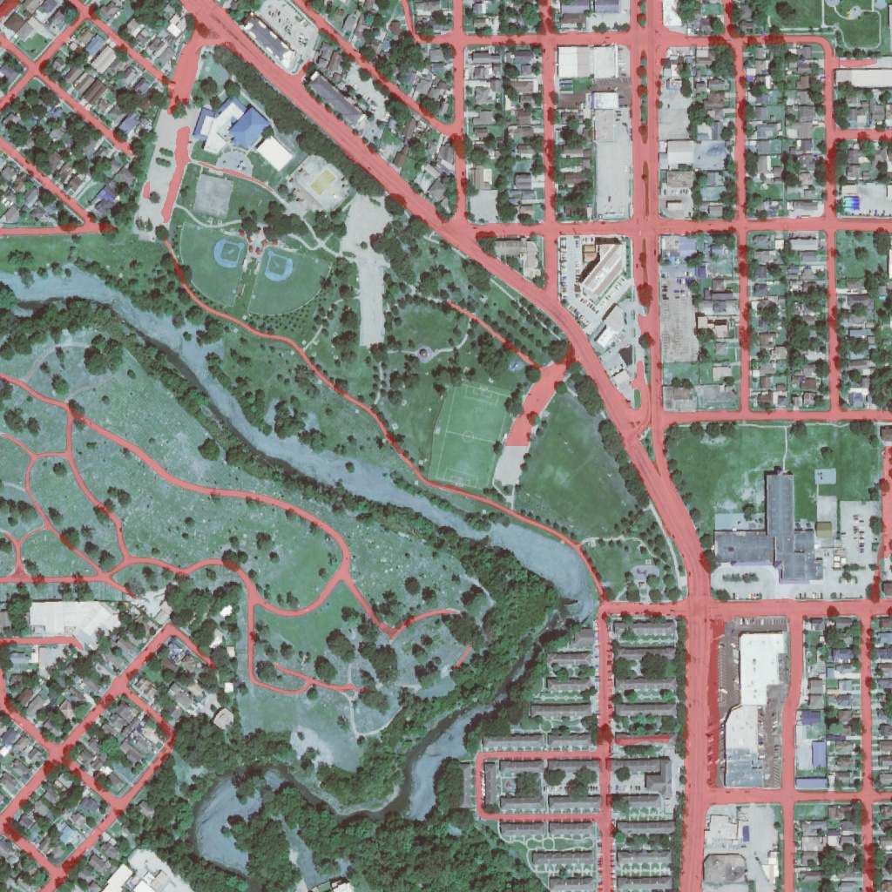

# Sanchari V4 🛰️🛣️

**State-of-the-Art Satellite Road Extraction Pipeline**

Sanchari is a robust deep learning solution designed to extract precise road networks from high-resolution satellite imagery (0.6m - 10m/px). 

**Current Version: V4** (EfficientNet-B4 + U-Net++ with Advanced Optimization)


---

## 🚀 The Journey: V1 to V4

The Sanchari project has evolved through rigorous experimentation to tackle the unique challenges of satellite imagery (shadows, occlusion, connectivity).

| Feature | V1 (Baseline) | V2 (Transfer Learning) | V3 (Refinement) | **V4 (State-of-the-Art)** |
| :--- | :--- | :--- | :--- | :--- |
| **Architecture** | Custom U-Net | ResNet34-UNet | ResNet34-UNet + Attention | **U-Net++ w/ EfficientNet-B4** |
| **Input Size** | 256x256 (Patching) | 256x256 (Patching) | 1024x1024 (Sliding Window) | **512x512 (50% Overlap)** |
| **Loss Function** | BCE Loss | Dice Loss | Dice Loss | **Combo (Dice+Focal) + Lovász** |
| **Inference** | Simple Prediction | Simple Prediction | 4-Way TTA | **Multi-Scale TTA + Graph Closing** |
| **Connectivity** | Poor (Broken Roads) | Fair | Good | **Excellent (Graph Closing + Pruning)** |
| **IoU Score** | ~55% | ~68% | ~75% | **Targeting 85%+** |

---

## 🧠 V4 Architecture Breakdown

The V4 pipeline is designed for maximum accuracy, leveraging modern architectural advances and specialized post-processing.

### 1. Model: U-Net++ with EfficientNet-B4
*   **Encoder**: `timm-efficientnet-b4` (Pretrained on ImageNet).
*   **Decoder**: **U-Net++** (Nested U-Net).

### 2. Advanced Post-Processing (New in V4)
We apply a multi-stage refinement pipeline to clean up predictions:
1.  **Hole Filling**: Fills small gaps/holes inside wide roads to prevent skeleton loops.
2.  **Graph-Based Gap Closing**:
    *   Converts skeleton to a graph.
    *   Connects broken endpoints within **25px** distance.
    *   Heals breaks caused by shadows or tree cover.
3.  **Skeleton Pruning**:
    *   Iteratively removes short "spurs" (branches < 15px) from the centerline.
    *   Ensures clean, topological vector outputs.

### 3. Inference Pipeline
*   **TTA**: 4-Way Test Time Augmentation (Original, Flip H, Flip V, Rot 90).
*   **Sliding Window**: 512x512 patches with 50% overlap to eliminate edge artifacts.

---

## 🛠️ Setup & Usage

### 1. Installation
```bash
git clone https://github.com/lokrim/sanchari-model.git
cd sanchari-model
pip install -r requirements.txt
```

### 2. Training (V4)
Train the robust U-Net++ model. Handles 512x512 tiling and Gradient Accumulation automatically.
```bash
python train_v4.py
```

### 3. Fine-Tuning (Lovász Loss)
Push the accuracy further by optimizing IoU directly.
```bash
python train_v4_lovasz.py
```

### 4. Advanced Inference (SOTA)
Run the full Multi-Scale TTA + Graph pipeline on random US locations via Google Earth Engine.
```bash
python predict_gee_advanced_v4.py
```
*   *Note: This is slower (~30s/image) but produces the highest quality results.*

### 5. API Server (Real-time)
Deploy the model as a FastAPI endpoint.
```bash
python main_gee_v4.py
```

---

## 📊 Results Gallery

### V4 Predictions (Overlay)
| Urban Area | Rural Area |
| :---: | :---: |
|  |  |

### Evolution
| V1 (Noisy) | V2 (Better) | V3 (Good) | V4 (Clean & Connected) |
| :---: | :---: | :---: | :---: |
|  |  |  |  |

---

## 📂 Project Structure

*   `model_v4.py`: U-Net++ EfficientNet Definition.
*   `train_v4.py`: Main training loop.
*   `train_v4_lovasz.py`: Fine-tuning script.
*   `predict_gee_advanced_v4.py`: SOTA Inference script.
*   `optimize_threshold_v4.py`: Threshold tuning tool.
*   `main_gee_v4.py`: API Server.
*   `/weights`: Store `best_model_v4.pth`.
*   `/predicted`: Output directory.

---

## 🤝 Contributing
Contributions are welcome! Please open an issue or PR for any improvements.

---

**License**: MIT
