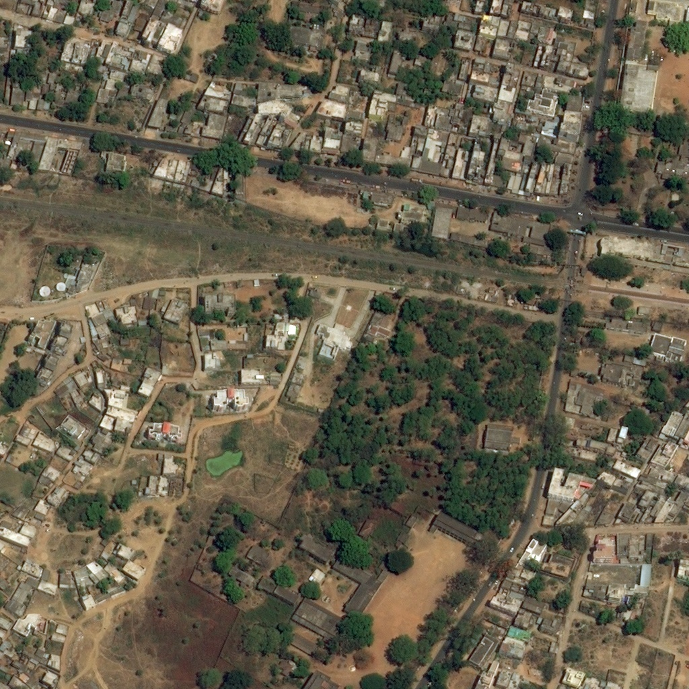

# SANCHARi 🛰️🛣️

**Satellite Road Extraction Pipeline — V3 (Sliding Window + TTA + Morphology)**

> **Branch:** `v3` — Precision leap. Same ResNet34-UNet backbone as V2, but introduces **sliding window inference**, **4-way Test Time Augmentation**, **morphological post-processing**, **skeletonization**, and a **GeoJSON API** (local GeoTIFF + optional GEE).

> **Mission:** Democratizing satellite-based road mapping. SANCHARi provides an open-source pipeline for extracting road networks from satellite imagery — enabling accessible GIS for disaster relief, urban planning, and regions where vector maps are outdated or absent.

|  |
|:---:|
| *Raw satellite input (DeepGlobe dataset)* |

|  |  |
|:---:|:---:|
| *V3 Predicted mask (~75% IoU)* | *Ground truth mask* |

---

## 🚀 Version Evolution

V3 is the **inference quality** branch — same strong backbone as V2, major precision gains from how the model is applied:

| Feature | V1 | V2 | **V3 (This Branch)** | V4 |
| :--- | :--- | :--- | :--- | :--- |
| **Architecture** | Custom U-Net | ResNet34-UNet | **ResNet34-UNet** | U-Net++ w/ EfficientNet-B4 |
| **Inference Strategy** | 256×256 direct patch | 256×256 direct patch | **1024×1024 Sliding Window (stride=128)** | 512×512 (50% Overlap) |
| **Test Time Augmentation** | None | None | **4-Way TTA (H-flip, V-flip, Rot90)** | 4-Way TTA |
| **Post-Processing** | Threshold only | Threshold only | **Morphology (remove noise, close gaps) + Skeletonize** | Graph-theoretic (sknw + NetworkX) |
| **Output Format** | PNG mask | PNG mask | **PNG mask + Skeleton + GeoJSON LineString** | Skeleton + GeoJSON FeatureCollection |
| **GEE Integration** | None | None | **Optional (NAIP / Sentinel-2)** | Full (NAIP + Sentinel-2) |
| **Resume Training** | No | No | **Yes (checkpoint)** | Yes |
| **IoU Score** | ~55% | ~68% | **~75%** | ~80% |

---

## 🧠 V3 Architecture & Inference Pipeline

```
Input (Large Satellite Image — 1024×1024)
       ↓
Sliding Window (256×256 patches, stride=128 → 50% overlap)
   For each patch:
   ┌────────────────────────────────────────────────────┐
   │  4-Way Test Time Augmentation (TTA)                │
   │  1. Original                                       │
   │  2. Horizontal flip → predict → unflip            │
   │  3. Vertical flip → predict → unflip              │
   │  4. Rotate 90° → predict → unrotate              │
   │  → Average all 4 probability maps                 │
   └────────────────────────────────────────────────────┘
       ↓
Accumulate & average overlapping patch probabilities
       ↓
Post-Processing:
   1. Threshold at 0.45 → binary mask
   2. remove_small_objects (max_size=100) — noise removal
   3. closing (disk=3) — gap bridging
   4. skeletonize → 1-pixel road centerlines
       ↓
Vectorize → GeoJSON LineString FeatureCollection (WGS84)
```

**Why sliding window + TTA over V2's direct patching?**

V2 feeds non-overlapping 256×256 patches: objects at tile boundaries are cut off mid-context. V3's 50% overlap means every road segment is predicted multiple times and averaged — reducing edge artifacts dramatically. TTA further reduces variance by averaging geometric augmentations aligned to likely road orientations.

---

## 🗂️ Data Pipeline

### Preprocessing (`src/preprocess.py`)

V3 introduces an improved tiling pipeline over V1:
- Uses `rasterio` for robust GeoTIFF reading (preserves multi-spectral data correctly)
- `cv2.BORDER_REFLECT` padding avoids black-edge artifacts on image borders

```bash
python src/preprocess.py
```

```
data/raw/train/*_sat.jpg + *_mask.png     ← raw DeepGlobe images
   ↓ rasterio read → 256×256 tile + reflect-pad
data/processed/train/images/   ← .jpg tiles
data/processed/train/masks/    ← .png binary masks
```

### Augmentation (`src/dataset.py`)

V3 adds **color augmentations** on top of V2's deformation suite:

| Category | Transforms |
| :--- | :--- |
| Geometric | `HorizontalFlip`, `VerticalFlip`, `Rotate(90°)`, `Transpose` |
| Deformation | `GridDistortion(p=0.5)`, `ElasticTransform(p=0.5)` |
| Color/Intensity | `RandomBrightnessContrast(p=0.5)`, `HueSaturationValue(p=0.3)` |
| Normalization | ImageNet stats: mean `[0.485, 0.456, 0.406]`, std `[0.229, 0.224, 0.225]` |

`HueSaturationValue` and `RandomBrightnessContrast` make the model robust to seasonal and lighting variations across satellite imagery.

---

## 🏋️ Training (`src/train.py`)

| Parameter | Value |
| :--- | :--- |
| Epochs | 50 |
| Batch Size | 16 |
| Optimizer | AdamW (lr=1e-4, weight_decay=1e-5) |
| Scheduler | CosineAnnealingLR (T_max=75) |
| Loss Function | `smp.losses.DiceLoss(mode='binary')` |
| Validation Split | 85% train / 15% val |
| Checkpoint | `checkpoint_v3.pth` (resumes with `--resume`) |
| Saves to | `weights/best_model_v3.pth` |
| Training log | `training_log_v3.csv` |

V3 adds **checkpoint resumption** — training can be interrupted and continued:

```bash
python src/train.py               # start fresh
python src/train.py --resume      # resume from checkpoint_v3.pth
```

---

## 🛠️ Usage Guide

All scripts resolve paths from the script's own location — run from **any working directory**.

### 1. Setup

```bash
git clone https://github.com/lokrim/sanchari-model.git
cd sanchari-model
git checkout v3
pip install -r requirements.txt
```

### 2. Preprocess Data

```bash
python src/preprocess.py   # tiles DeepGlobe data to 256×256 patches
```

### 3. Train

```bash
python src/train.py
# Or resume:
python src/train.py --resume
```

### 4. Batch Inference (Local Images)

Runs the full pipeline (sliding window + TTA + morphology + skeletonize) on a folder of images:

```bash
python src/predict.py --input test-images --output predicted/predictedv3
```

Outputs per image: `_input.jpg`, `_prob.png`, `_mask.png`, `_skeleton.png`, `_overlay.jpg`

### 5. Local GeoTIFF API Server

Serves predictions from local GeoTIFF files via FastAPI:

```bash
python src/main.py                # normal mode
python src/main.py --debug        # saves intermediate images to predicted/predictedv3
```

```bash
curl -X POST "http://localhost:8000/predict" \
     -H "Content-Type: application/json" \
     -d '{"latitude": 30.2241, "longitude": -97.7816}'
```

Returns a GeoJSON `FeatureCollection` with `LineString` features in WGS84.

### 6. GEE API Server *(Optional)*

Fetches satellite imagery from Google Earth Engine on demand (requires authenticated GEE account):

```bash
python src/main_gee.py --debug    # Port 8001
```

```bash
curl -X POST "http://localhost:8001/predict" \
     -H "Content-Type: application/json" \
     -d '{"latitude": 40.763, "longitude": -73.970}'
```

### 7. Batch GEE Inference

Runs predictions across 10 random coordinates near major US cities:

```bash
python src/predict_gee.py
```

### 8. Threshold Optimization

```bash
python src/optimize_threshold.py
```

Sweeps thresholds 0.10–0.90 with full TTA + morphology applied, prints optimal threshold.

### 9. Tests

```bash
python src/test_scripts.py
```

Covers: model creation, Dice loss, dataset loading, sliding window inference, morphological ops, coordinate utils.

---

## 📂 Project Structure

```
sanchari-model/
├── src/
│   ├── model.py               # create_model(): ResNet34-UNet via SMP
│   ├── dataset.py             # RoadSegmentationDataset + V3 augmentations
│   ├── train.py               # Training loop with checkpoint resumption
│   ├── preprocess.py          # Tiling pipeline (rasterio + reflect-pad)
│   ├── predict.py             # Batch inference (sliding window + TTA + morphology)
│   ├── optimize_threshold.py  # Threshold sweep with TTA on validation set
│   ├── main.py                # FastAPI local GeoTIFF server (port 8000)
│   ├── main_gee.py            # FastAPI GEE server (port 8001)
│   ├── predict_gee.py         # Batch GEE inference across US cities
│   └── test_scripts.py        # Unit tests for all pipeline components
├── data/
│   ├── raw/train/             # Raw DeepGlobe images
│   └── processed/train/       # Tiled 256×256 patches
├── weights/
│   └── best_model_v3.pth      # Best trained model weights
├── geotiffs/                  # Local GeoTIFFs (for main.py)
├── test-images/               # Test images for batch inference
├── predicted/
│   ├── predictedv3/           # Inference outputs (mask, skeleton, overlay, prob)
│   └── output-geojson/        # Vectorized GeoJSON road centerlines
│   └── embed/                 # Comparison images across all versions
├── checkpoint_v3.pth          # Training checkpoint (resume support)
├── training_log_v3.csv        # Per-epoch training metrics
├── requirements.txt
└── README.md
```

---

## 📦 Dependencies

| Library | Purpose |
| :--- | :--- |
| `torch`, `torchvision` | Model training and inference |
| `segmentation-models-pytorch` | ResNet34-UNet + Dice loss |
| `albumentations` | Augmentation pipeline |
| `opencv-python` | Image I/O, patch tiling, overlay |
| `scikit-image` | `skeletonize`, `remove_small_objects`, `closing` |
| `rasterio` | GeoTIFF I/O + pixel coordinate mapping |
| `pyproj` | CRS transforms (WGS84 ↔ Web Mercator) |
| `fastapi`, `uvicorn`, `pydantic` | API server |
| `earthengine-api`, `requests` | GEE integration (optional) |
| `scikit-learn`, `pandas` | Train/val split, training log |
| `kaggle` | Dataset download |
| `tqdm`, `numpy` | Progress bars, numerical ops |

---

## ⚠️ V3 Limitations

V3 achieves ~75% IoU and produces clean road centerlines. Remaining gaps addressed in V4:

| Issue | Fix in... |
| :--- | :--- |
| Road graph has dangling branches and "hairs" from simple skeletonization | V4 (graph pruning via sknw + NetworkX) |
| GEE NAIP is US-only (Sentinel-2 at 10m resolution too coarse) | V4 (improved collection handling) |
| No topological output — roads are individual LineStrings, not a connected graph | V4 (GeoJSON FeatureCollection with graph topology) |
| EfficientNet backbone would extract richer features | V4 (U-Net++ w/ EfficientNet-B4) |

---

**License:** MIT | Branch: `v3` | IoU: ~75% | Architecture: ResNet34-UNet (SMP) | Inference: Sliding Window + 4-Way TTA | Post-Processing: Morphology + Skeletonization
