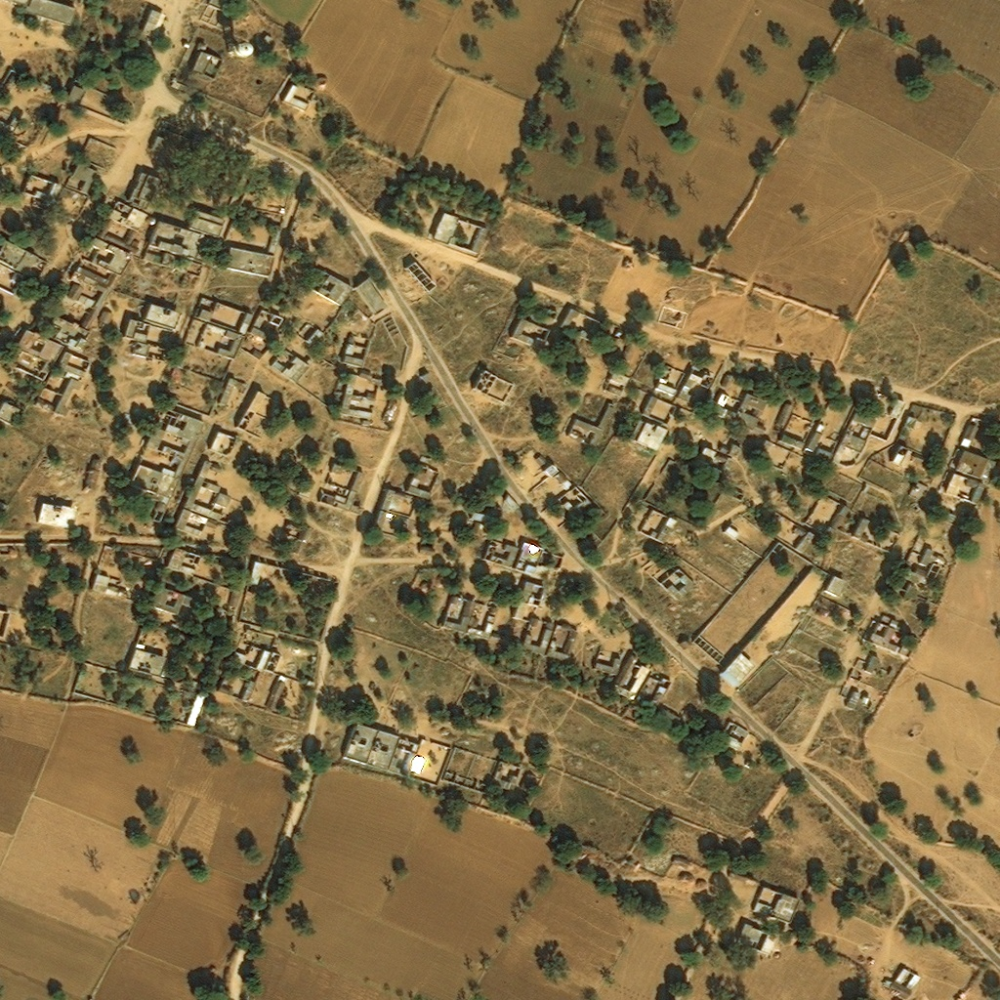
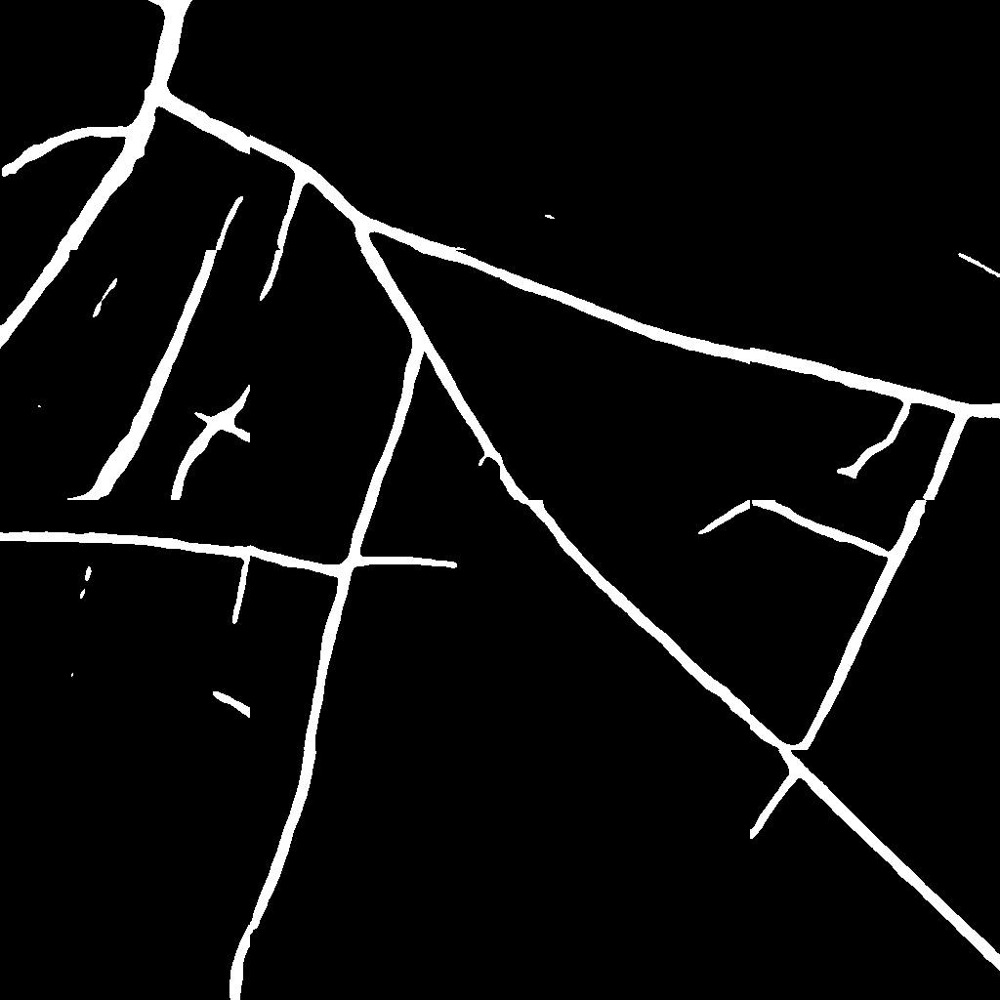
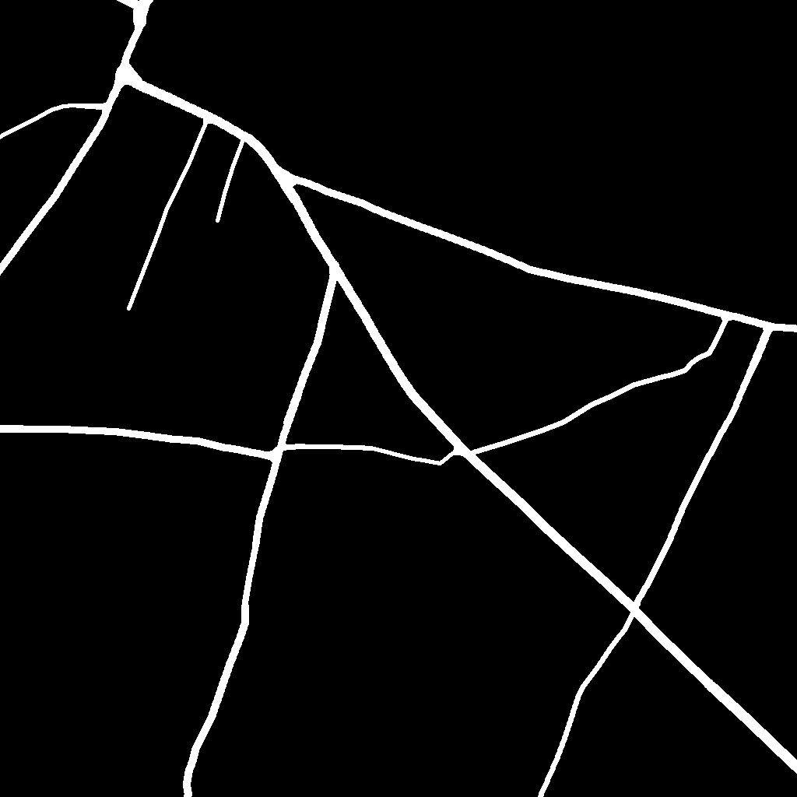

# SANCHARi 🛰️🛣️

**Satellite Road Extraction Pipeline — V2 (Transfer Learning)**

> **Branch:** `v2` — The first major leap. Replaces the custom U-Net from scratch with a **ResNet34 encoder pretrained on ImageNet**, delivering a +13pp IoU jump over V1.

> **Mission:** Democratizing satellite-based road mapping. SANCHARi provides an open-source pipeline for extracting road networks from satellite imagery — enabling accessible GIS for disaster relief, urban planning, and regions where vector maps are outdated or absent.

|  |
|:---:|
| *Raw satellite input (DeepGlobe dataset)* |

|  |  |
|:---:|:---:|
| *V2 Predicted mask (~68% IoU)* | *Ground truth mask* |

---

## 🚀 Version Evolution

V2 is the **transfer learning** branch — the jump from training from scratch to leveraging ImageNet features:

| Feature | V1 (Baseline) | **V2 (This Branch)** | V3 (Refinement) | V4 (State-of-the-Art) |
| :--- | :--- | :--- | :--- | :--- |
| **Architecture** | Custom U-Net (scratch) | **ResNet34-UNet (SMP)** | ResNet34-UNet + Attention | U-Net++ w/ EfficientNet-B4 |
| **Input Patching** | 256×256 direct | **256×256 direct** | 1024×1024 Sliding | 512×512 (50% Overlap) |
| **Loss Function** | BCE Loss | **Dice Loss** | Dice | Combo (Dice+Focal) → Lovász |
| **Augmentation** | Basic flips | **+GridDistortion, ElasticTransform** | Standard | GridDistortion + ElasticTransform |
| **Optimizer** | Adam | **AdamW + Cosine Annealing** | AdamW | AdamW + Cosine Annealing |
| **Inference** | Direct patch | **Direct patch** | 4-Way TTA | Sliding Window + 4-Way TTA |
| **Post-Processing** | Threshold only | **Threshold only** | Basic morphology | Graph-theoretic (sknw + NetworkX) |
| **Output** | PNG mask | **PNG mask** | PNG + basic GeoJSON | Skeleton + GeoJSON FeatureCollection |
| **IoU Score** | ~55% | **~68%** | ~75% | ~80% |

---

## 🧠 V2 Architecture: ResNet34 + U-Net (Transfer Learning)

V2 replaces the hand-crafted encoder with a **pretrained ResNet34** via [`segmentation_models_pytorch`](https://github.com/qubvel/segmentation_models.pytorch):

```
Input (256×256×3 RGB)
       ↓
ResNet34 Encoder (pretrained on ImageNet)
   Stage 1–5: rich hierarchical feature maps
   (edges → textures → object parts → semantics)
       ↓
U-Net Decoder (SMP standard)
   Skip connections from each ResNet stage
   Bilinear upsampling back to 256×256
       ↓
Output logit map (256×256×1)
       ↓
Sigmoid → threshold at 0.4 → binary road mask
```

**Why transfer learning over training from scratch?**

ResNet34 was pretrained on 1.2M ImageNet images. Its early layers already encode universal visual features — edges, gradients, texture patterns — that transfer directly to aerial imagery. V2 fine-tunes these representations for road detection rather than learning them from zero, which is why it achieves **+13pp IoU** over V1 with the same dataset and patch size.

---

## 🗂️ Data Pipeline

### Dataset & Preprocessing

V2 uses the same **256×256 tiled patches** from the DeepGlobe Road Extraction dataset as V1. If you already have `data/processed/train/` from a V1 run, you can skip preprocessing entirely.

Use any external preprocessing script or the V1 `preprocess.py` to tile the raw DeepGlobe images:
```
data/raw/train/*_sat.jpg + *_mask.png
   ↓ tile into 256×256 patches (4×4 grid per image)
data/processed/train/images/   ← .jpg tiles
data/processed/train/masks/    ← .png binary masks
```

### Augmentation (`src/dataset.py`)

V2 extends V1's basic augmentations with deformation transforms:

| Category | Transforms |
| :--- | :--- |
| Geometric | `HorizontalFlip`, `VerticalFlip`, `RandomRotate90` |
| Deformation | `GridDistortion(p=0.2)`, `ElasticTransform(p=0.2)` |
| Normalization | ImageNet stats: mean `[0.485, 0.456, 0.406]`, std `[0.229, 0.224, 0.225]` |

`GridDistortion` and `ElasticTransform` are new to V2 — they simulate terrain-induced warping in satellite imagery, making the model more robust to geometric distortions in real-world predictions.

---

## 🏋️ Training (`src/train.py`)

| Parameter | Value |
| :--- | :--- |
| Epochs | 75 |
| Batch Size | 16 |
| Optimizer | AdamW (lr=1e-4, weight_decay=1e-5) |
| Scheduler | CosineAnnealingLR (T_max=75) |
| Loss Function | `smp.losses.DiceLoss(mode='binary')` |
| Validation Split | 85% train / 15% val |
| Metric | IoU (Intersection over Union) |
| Saves to | `weights/best_model_v2.pth` |
| Training log | `training_log_v2.csv` (epoch, loss, IoU, LR) |

**Why Dice Loss over BCE?**

BCE treats every pixel equally. Dice Loss directly optimizes the overlap ratio between prediction and ground truth — a better proxy for IoU when road pixels are a small fraction of the total image (class imbalance problem).

**Why AdamW + Cosine Annealing?**

AdamW adds proper weight decay (not coupled to the gradient step like in Adam), improving generalization. Cosine Annealing smoothly reduces the learning rate rather than stepping it down, allowing finer convergence in the later epochs.

---

## 🛠️ Usage Guide

All commands run from the **repository root** or from `src/` — paths are resolved from the script's location either way.

### 1. Setup

```bash
git clone https://github.com/lokrim/sanchari-model.git
cd sanchari-model
git checkout v2
pip install -r requirements.txt
```

### 2. Prepare Data

Tile DeepGlobe images into 256×256 patches (skip if you already have `data/processed/` from V1):

```bash
# manually download DeepGlobe from Kaggle and extract to data/raw/train/
# then tile:
python src/preprocess.py    # if you have a preprocess script
```

Expected structure after preprocessing:
```
data/processed/train/
├── images/   ← 256×256 .jpg tiles
└── masks/    ← 256×256 .png binary masks
```

### 3. Train

```bash
python src/train.py
```

Saves best checkpoint to `weights/best_model_v2.pth` and logs per-epoch metrics to `training_log_v2.csv`.

> Requires a CUDA-capable GPU. RTX 3060+ recommended (tested on RTX 4090).

### 4. Batch Inference

Run predictions on a folder of 1024×1024 satellite images:

```bash
python src/predict.py --input-folder test-images --output-folder predicted/predictedv2
```

Each image is tiled into 256×256 patches, predicted independently, and reassembled into a full mask. Output files are saved as `<name>_pred_mask_v2.png`.

### 5. Threshold Optimization

Find the IoU-maximizing classification threshold on the validation set (default is `0.4`):

```bash
python src/optimize_threshold.py
```

Sweeps thresholds from 0.20 to 0.80 and prints the optimal value.

---

## 📂 Project Structure

```
sanchari-model/                  ← Repo root — scripts resolve paths from here
├── src/
│   ├── model.py                 # create_model(): ResNet34-UNet via SMP
│   ├── dataset.py               # RoadSegmentationDataset + V2 augmentations
│   ├── train.py                 # Training loop (Dice loss, AdamW, CosineAnnealing)
│   ├── predict.py               # Batch inference on local image folder
│   └── optimize_threshold.py   # Sweep thresholds to find best IoU on val set
├── data/
│   ├── raw/train/               # Raw DeepGlobe images and masks
│   └── processed/train/         # Tiled 256×256 patches
├── weights/
│   └── best_model_v2.pth        # Best trained model weights
├── test-images/                 # Test satellite images for batch inference
├── predicted/
│   └── embed/                   # Comparison images across all versions
├── training_log_v2.csv          # Per-epoch training metrics (generated by train.py)
├── requirements.txt
└── README.md
```

---

## 📦 Dependencies

| Library | Purpose |
| :--- | :--- |
| `torch`, `torchvision` | Model training and inference |
| `segmentation-models-pytorch` | ResNet34-UNet architecture + Dice loss |
| `albumentations` | Image augmentation pipeline |
| `opencv-python` | Image I/O (BGR→RGB, patch extraction) |
| `scikit-learn` | Train/validation split |
| `pandas` | Training log CSV |
| `kaggle` | Dataset download |
| `tqdm`, `numpy` | Progress bars, numerical ops |

---

## ⚠️ V2 Limitations

V2 achieves ~68% IoU — a major improvement over V1. Remaining gaps addressed in V3/V4:

| Issue | Fix in... |
| :--- | :--- |
| No sliding window — patches at tile edges still lose context | V3 (1024×1024 sliding window) |
| No Test Time Augmentation — single-pass inference | V3 (4-Way TTA) |
| Fragmented predictions — thresholding only, no topology repair | V3 (morphology), V4 (graph pruning) |
| No GEE integration | V4 (NAIP + Sentinel-2 via GEE API) |
| Output format is PNG mask, not road centerline | V4 (graph-theoretic skeletonization + GeoJSON) |

---

**License:** MIT | Branch: `v2` | IoU: ~68% | Architecture: ResNet34-UNet (SMP) | Loss: Dice
