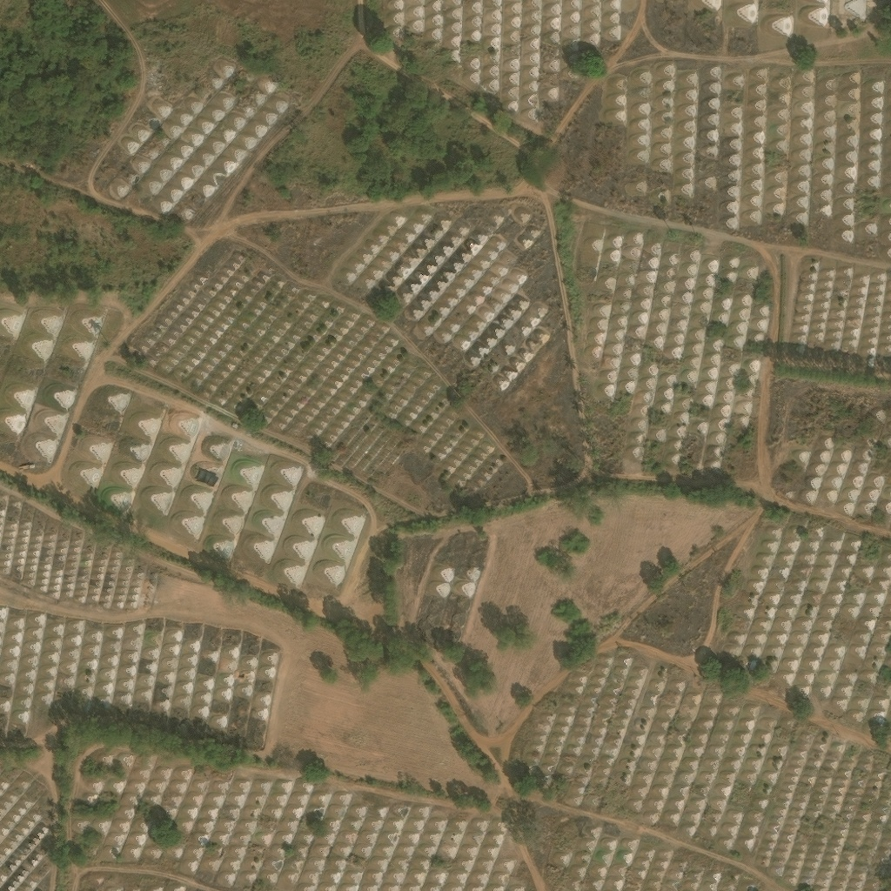
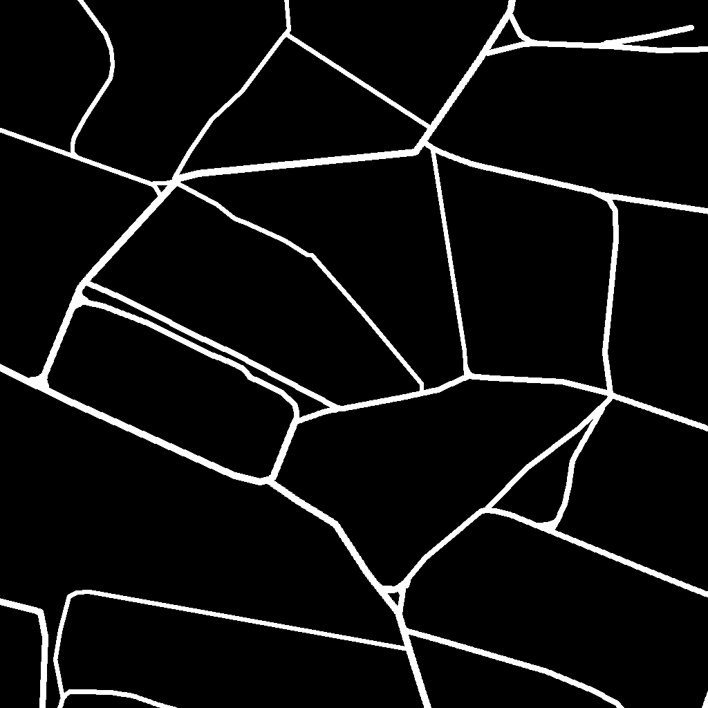

# SANCHARi 🛰️🛣️

**Satellite Road Extraction Pipeline — V1 (Baseline)**

> **Branch:** `v1` — The founding version. A custom U-Net trained from scratch on the DeepGlobe Road Extraction dataset. This is where SANCHARi began.

> **Mission:** Democratizing satellite-based road mapping. SANCHARi provides an open-source pipeline for extracting road networks from satellite imagery — enabling accessible GIS for disaster relief, urban planning, and regions where vector maps are outdated or absent.

|  |
|:---:|
| *Raw satellite input (DeepGlobe dataset)* |

|  |  |
|:---:|:---:|
| *V1 Predicted mask (~55% IoU)* | *Ground truth mask* |

---

## 🚀 Version Evolution

V1 is the **baseline**. Each subsequent branch builds on it:

| Feature | **V1 (This Branch)** | V2 (Transfer Learning) | V3 (Refinement) | V4 (State-of-the-Art) |
| :--- | :--- | :--- | :--- | :--- |
| **Architecture** | **Custom U-Net (scratch)** | ResNet34-UNet | ResNet34-UNet + Attention | U-Net++ w/ EfficientNet-B4 |
| **Input Patching** | **256×256 direct** | 256×256 direct | 1024×1024 Sliding | 512×512 (50% Overlap) |
| **Loss Function** | **BCE Loss** | Dice | Dice | Combo (Dice+Focal) → Lovász |
| **Augmentation** | **Basic flips/rotations** | Standard | Standard | GridDistortion + ElasticTransform |
| **Inference** | **Direct patch** | Direct patch | 4-Way TTA | Sliding Window + 4-Way TTA |
| **Post-Processing** | **Threshold only** | Threshold only | Basic morphology | Graph-theoretic (sknw + NetworkX) |
| **Output** | **PNG mask** | PNG mask | PNG + basic GeoJSON | Skeleton + GeoJSON FeatureCollection |
| **IoU Score** | **~55%** | ~68% | ~75% | ~80% |
| **API** | **Basic FastAPI (local GeoTIFF)** | Basic Flask | FastAPI | FastAPI (2 servers) |

---

## 🧠 V1 Architecture: Custom U-Net

V1 implements a **standard U-Net from scratch** — no pretrained backbone, no external architecture library.

```
Input (256×256×3 RGB)
       ↓
Encoder (5 levels)
   inc:   3 → 64     (DoubleConv)
   down1: 64 → 128   (MaxPool2d + DoubleConv)
   down2: 128 → 256  (MaxPool2d + DoubleConv)
   down3: 256 → 512  (MaxPool2d + DoubleConv)
   down4: 512 → 512  (MaxPool2d + DoubleConv, bilinear mode)
       ↓
Decoder (4 Up-blocks, bilinear upsampling + skip connections)
   up1: 1024 → 256
   up2: 512  → 128
   up3: 256  → 64
   up4: 128  → 64
       ↓
Output Conv (64 → 1, kernel=1)  → raw logit map
       ↓
Sigmoid → threshold at 0.5 → binary road mask
```

**Key building blocks** (`src/model.py`):
- `DoubleConv`: Two Conv2d → BatchNorm → ReLU layers
- `Down`: MaxPool2d followed by DoubleConv
- `Up`: Bilinear upsample, pad to match skip, concat, DoubleConv
- `OutConv`: 1×1 convolution to single output channel

---

## 🗂️ Data Pipeline

### Preprocessing (`src/preprocess.py`)

The [DeepGlobe Road Extraction dataset](https://www.kaggle.com/datasets/balraj98/deepglobe-road-extraction-dataset) contains ~6,226 high-resolution (1024×1024) satellite + mask pairs.

V1 tiles each 1024×1024 image into **16 non-overlapping 256×256 patches** (4×4 grid):

```
1024×1024 source image
       ↓
Tile into 256×256 patches (no overlap, 4×4 = 16 tiles per image)
       ↓
Save to:
  data/processed/train/images/   ← .jpg tiles
  data/processed/train/masks/    ← .png binary masks
```

### Dataset & Augmentation (`src/dataset.py`)

`RoadSegmentationDataset` loads tiles on the fly. Augmentations applied during training:

| Category | Transforms |
| :--- | :--- |
| Geometric | `HorizontalFlip`, `VerticalFlip`, `RandomRotate90` |
| Normalization | ImageNet stats: mean `[0.485, 0.456, 0.406]`, std `[0.229, 0.224, 0.225]` |

---

## 🏋️ Training (`src/train.py`)

| Parameter | Value |
| :--- | :--- |
| Epochs | 25 |
| Batch Size | 16 |
| Optimizer | Adam (lr=1e-4) |
| Loss Function | `BCEWithLogitsLoss` |
| Validation Split | 85% train / 15% val |
| Metric | IoU (Intersection over Union) |
| Saves to | `weights/best_model_v1.pth` |

The best model (highest validation IoU) is checkpointed automatically each epoch.

---

## 🛠️ Usage Guide

All commands are run from the **repository root**.

### 1. Setup

```bash
git clone https://github.com/lokrim/sanchari-model.git
cd sanchari-model
git checkout v1
pip install -r requirements.txt
```

### 2. Preprocess

Download and tile the DeepGlobe dataset:

```bash
# Manually download from Kaggle and extract to data/raw/train/
# OR, if the Kaggle CLI is configured:
# kaggle datasets download balraj98/deepglobe-road-extraction-dataset

python src/preprocess.py
```

Output: `data/processed/train/images/` and `data/processed/train/masks/`

### 3. Train

```bash
python src/train.py
```

Saves the best model to `weights/best_model_v1.pth`.

> Requires a CUDA-capable GPU. CPU training is supported but significantly slower.

### 4. Batch Inference

Run predictions on a folder of 1024×1024 satellite images:

```bash
python src/predict.py --input-folder test-images --output-folder predicted/predictedv1
```

For each image, produces a `<name>_pred_mask.png` binary mask in the output folder.

Sample predictions from the dataset are in `predicted/predictedv1/`.

### 5. Threshold Optimization

Find the IoU-maximizing threshold on the validation set:

```bash
python src/optimize_threshold.py
```

Default threshold is `0.5`. This script sweeps 0.20–0.80 to find the best value.

### 6. Local GeoTIFF API

Serve live predictions over a REST API backed by local `.tif` files:

```bash
python src/main.py
```

**Endpoint:** `POST /predict` on port **8000**

```bash
curl -X POST http://localhost:8000/predict \
  -H "Content-Type: application/json" \
  -d '{"latitude": 30.2249, "longitude": -97.7846}'
```

Place `.tif` files in `./geotiffs/`. The API scans all `.tif` files, finds the one whose bounds contain the given coordinate, crops a 1024×1024 window, runs inference, and returns a GeoJSON FeatureCollection of road polygons.

> **Note:** V1 returns polygon shapes from rasterio, not a skeletonized road graph. The full graph-theoretic GeoJSON pipeline is introduced in V4.

### 7. Debug Utilities

```bash
# Verify a coordinate is covered by a local GeoTIFF
python src/check_coords.py <latitude> <longitude>
# Example:
python src/check_coords.py -43.5609 172.7358

# Verify GEE credentials (GEE not used in V1, but useful for future versions)
python src/check_gee.py
```

---

## 📂 Project Structure

```
sanchari-model/                  ← Repo root — run all scripts from here
├── src/
│   ├── model.py                 # Custom U-Net architecture (from scratch)
│   ├── dataset.py               # PyTorch Dataset + Albumentations augmentation
│   ├── preprocess.py            # Tile 1024×1024 → 256×256 patches
│   ├── train.py                 # Training loop (BCE loss, Adam, IoU metric)
│   ├── predict.py               # Batch inference on local images
│   ├── optimize_threshold.py    # Sweep thresholds to maximize IoU
│   ├── main.py                  # FastAPI server — local GeoTIFF (port 8000)
│   ├── check_coords.py          # Debug: coordinate → GeoTIFF coverage check
│   └── check_gee.py             # Debug: GEE credential check (future use)
├── data/
│   ├── raw/train/               # Raw DeepGlobe images and masks
│   └── processed/train/         # Tiled 256×256 patches (generated by preprocess.py)
├── weights/
│   └── best_model_v1.pth        # Best trained model weights
├── geotiffs/                    # Local GeoTIFF files for the API
├── test-images/                 # Test satellite images for batch inference
├── predicted/
│   ├── predictedv1/             # Batch inference outputs for V1
│   └── embed/                   # Comparison images across all versions
├── ipynb/                       # Jupyter notebooks for exploration
├── requirements.txt
└── README.md
```

---

## 🌐 API Output — GeoJSON

The `main.py` API returns a **GeoJSON FeatureCollection** of road polygon boundaries (EPSG:4326), loadable in QGIS, Mapbox, and Leaflet:

```json
{
  "type": "FeatureCollection",
  "features": [
    {
      "type": "Feature",
      "geometry": {
        "type": "MultiLineString",
        "coordinates": [
          [[-97.743, 30.267], [-97.744, 30.268]]
        ]
      },
      "properties": {}
    }
  ]
}
```

---

## 📦 Dependencies

| Library | Purpose |
| :--- | :--- |
| `torch`, `torchvision` | U-Net model definition and training |
| `albumentations` | Image augmentation pipeline |
| `opencv-python` | Image I/O (BGR→RGB, patch extraction) |
| `scikit-learn` | Train/validation split |
| `rasterio`, `pyproj` | GeoTIFF I/O and CRS projection (API) |
| `fastapi`, `uvicorn`, `pydantic` | REST API server |
| `kaggle` | Dataset download (preprocessing) |
| `prettytable` | Check-coords debug output formatting |
| `tqdm`, `numpy` | Progress bars, numerical ops |

---

## ⚠️ V1 Limitations

V1 is intentionally minimal. Known limitations addressed in later versions:

| Issue | Fix in... |
| :--- | :--- |
| ~55% IoU — model trains from scratch, no pretrained features | V2 (ResNet34 transfer learning) |
| No sliding window — patches at tile edges lose context | V3 (1024×1024 sliding window) |
| Fragmented predictions — no post-processing beyond thresholding | V3 (morphology), V4 (graph pruning) |
| No GEE integration — requires local GeoTIFF files | V4 (NAIP + Sentinel-2 via GEE) |
| Output is polygon mask, not road centerline skeleton | V4 (graph-theoretic skeletonization) |

---

**License:** MIT | Branch: `v1` | IoU: ~55% | Architecture: Custom U-Net from scratch
