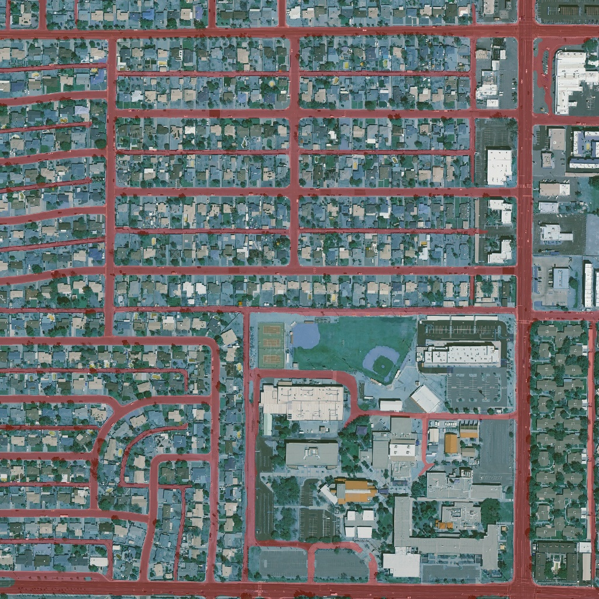
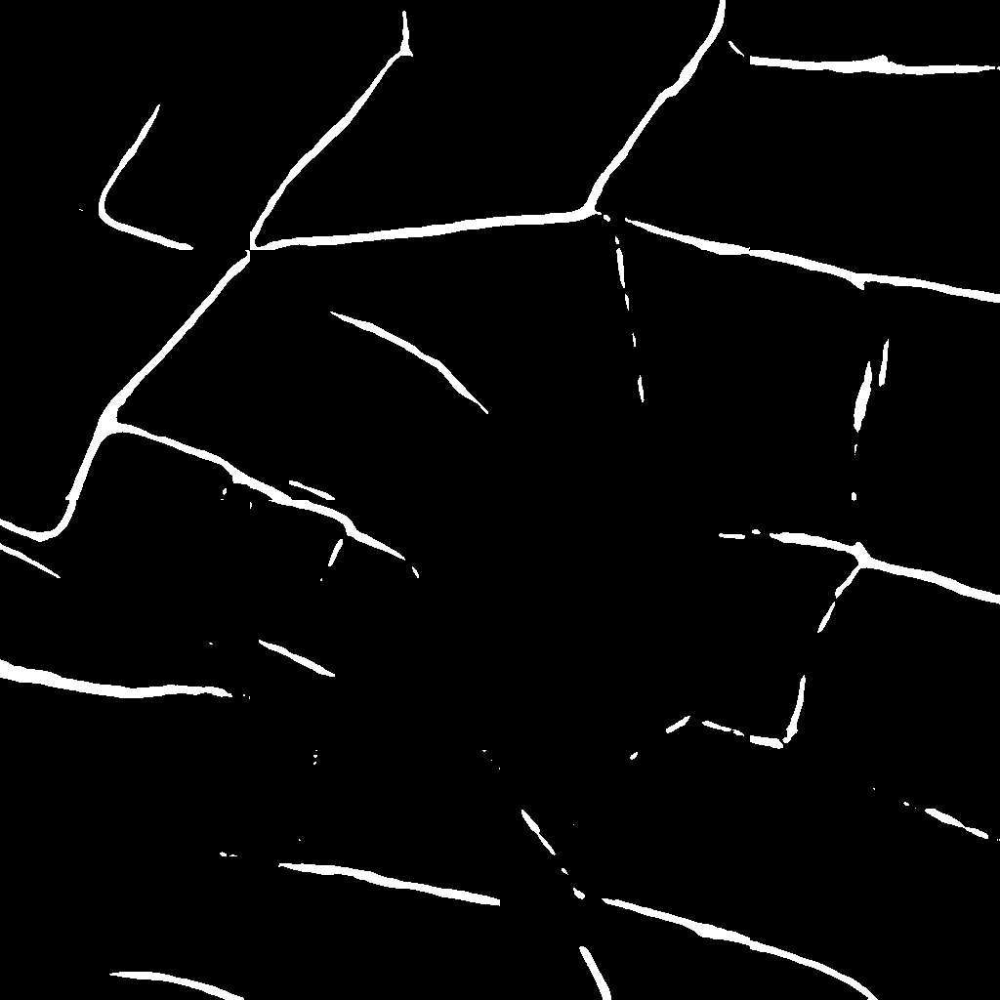
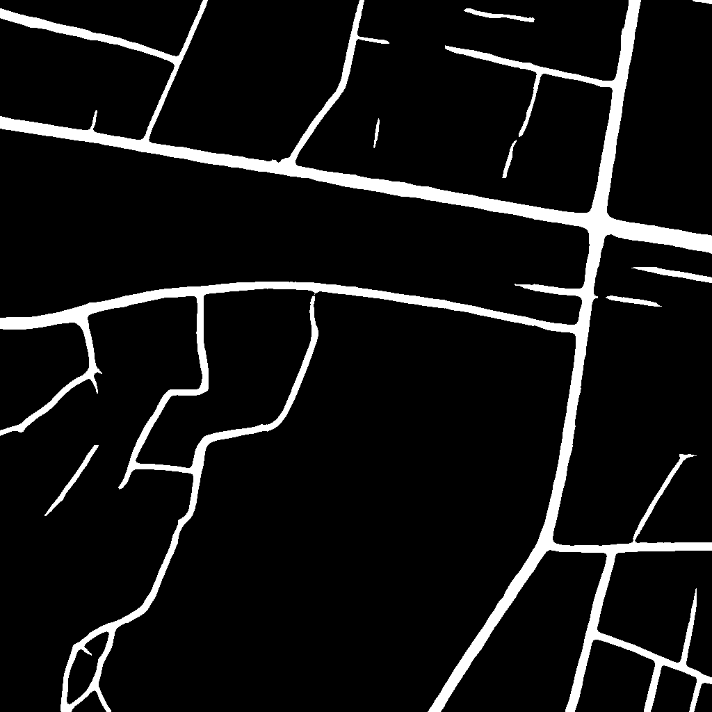
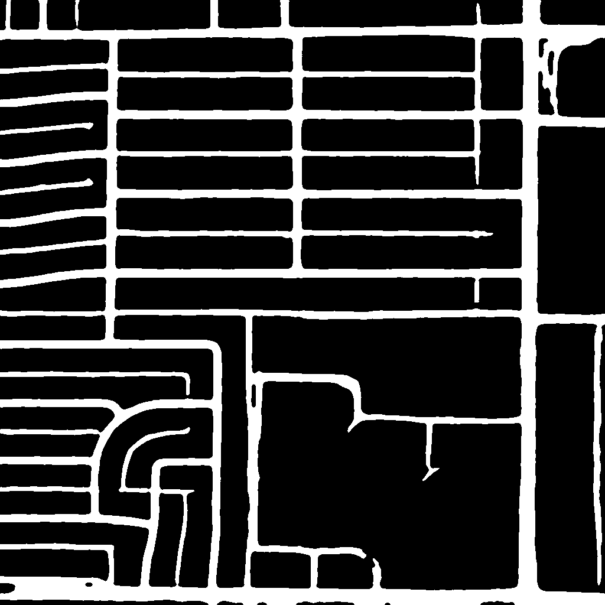

# SANCHARi 🛰️🛣️

**Satellite Road Extraction Pipeline — V4**

> **Mission:** Democratizing high-quality satellite analytics. SANCHARi provides a robust, open-source pipeline for extracting road networks from satellite imagery (NAIP, Sentinel-2, or local GeoTIFFs), enabling accessible mapping for disaster relief, urban planning, and developing regions where vector maps are outdated or missing.



---

## 🚀 Project Evolution: V1 → V4

| Feature | V1 (Baseline) | V2 (Transfer Learning) | V3 (Refinement) | **V4 (Current)** |
| :--- | :--- | :--- | :--- | :--- |
| **Architecture** | Custom U-Net | ResNet34-UNet | ResNet34-UNet + Attention | **U-Net++ w/ EfficientNet-B4** |
| **Input Patching** | 256×256 | 256×256 | 1024×1024 Sliding | **512×512 (50% Overlap)** |
| **Loss Function** | BCE | Dice | Dice | **Combo (Dice+Focal) → Lovász** |
| **Augmentation** | Basic flips | Standard | Standard | **GridDistortion + ElasticTransform** |
| **Inference** | Direct patch | Direct patch | 4-Way TTA | **Sliding Window + 4-Way TTA** |
| **Post-Processing** | Threshold only | Threshold only | Basic morphology | **Graph-theoretic (sknw + NetworkX)** |
| **Output** | PNG mask | PNG mask | PNG + basic GeoJSON | **Skeleton + GeoJSON FeatureCollection** |
| **IoU Score** | ~55% | ~68% | ~75% | **~80%** |

### Visual Progression

| V1 (Noisy) | V3 (Improved) | **V4 (Clean & Connected)** |
| :---: | :---: | :---: |
|  |  |  |

---

## 🧠 Technical Deep Dive

### 1. Architecture: U-Net++ & EfficientNet-B4 (`model_v4.py`)

V4 uses a **U-Net++** decoder with an **EfficientNet-B4** encoder via `segmentation_models_pytorch`.

- **EfficientNet-B4**: Compound-scaled backbone (depth × width × resolution) pretrained on ImageNet. Far richer feature representations than ResNet34 with comparable parameter efficiency (~19M params).
- **U-Net++**: Replaces standard skip connections with *dense, nested* skip pathways between every encoder and decoder level. Reduces the semantic gap, preserving sub-pixel spatial detail critical for thin road extraction.

### 2. Training Strategy (`train_v4.py` + `train_v4_lovasz.py`)

**Phase 1 — Main Training (50 epochs):**
- **ComboLoss**: `0.5 × DiceLoss + 0.5 × FocalLoss`
  - Dice optimizes overlap; Focal focuses the model on hard pixels (road edges, shadows, intersections).
- **Optimizer**: AdamW (lr=5e-4, weight_decay=1e-4) with Cosine Annealing scheduler.
- **Gradient Accumulation**: Effective batch size of 16 (8 × 2 steps) to fit within GPU VRAM.

**Phase 2 — Hard Negative Mining (optional, `--hard-mining` flag, +10 epochs):**
- Computes per-image IoU on the full training set.
- Isolates the bottom 20% hardest samples (lowest IoU).
- Fine-tunes exclusively on hard samples at LR=1e-5.

**Phase 3 — Lovász Fine-Tuning (`train_v4_lovasz.py`, 20 epochs):**
- Switches loss to `LovaszLoss` — directly optimizes the Jaccard index via convex surrogation.
- Very conservative LR (1e-5) applied to the best ComboLoss checkpoint.

### 3. Advanced Post-Processing Pipeline (`postprocess_v4.py`)

Raw segmentation masks are noisy. V4 applies a full **graph-theoretic refining pipeline**:

1. **Threshold & Hole Fill** — `prob > 0.45`; fill holes ≤ 400px to prevent false skeleton loops inside wide roads.
2. **Noise Removal** — remove speckle objects < 100px; morphological `closing(disk=3)` to smooth boundaries.
3. **EDT Skeletonize** — convert binary mask to a 1-pixel-wide centerline skeleton.
4. **sknw Graph** — convert skeleton to a NetworkX MultiGraph (junctions = nodes, road segments = weighted edges with pixel-coordinate paths).
5. **Prune & Clean** — iteratively remove short spurs (< 20px), collapse false self-loops (< 100px perimeter), remove redundant parallel edges, clean isolated nodes.
6. **Vectorize** — apply affine transform (pixel coords → projected coords), simplify geometry, export as EPSG:4326 GeoJSON.

> Why a graph instead of morphological gap-closing? A graph lets us reason about *road connectivity* precisely — connecting true endpoints without bloating blobs or destroying topology.

### 4. Inference: Sliding Window + 4-Way TTA

All four inference scripts share the same strategy:

- **Sliding Window**: 512×512 patches, 256-stride (50% overlap), reflect-padded to cover edges.
- **4-Way TTA**: Each patch is predicted in 4 orientations (original, H-flip, V-flip, 90° rotate) → averaged → accumulated into full-image probability map.
- **Normalization**: ImageNet stats (mean=`[0.485, 0.456, 0.406]`, std=`[0.229, 0.224, 0.225]`).

---

## 🛠️ Usage Guide

### 1. Setup

```bash
git clone https://github.com/lokrim/sanchari-model.git
cd sanchari-model
pip install -r requirements.txt
```

### 1B. Docker Setup (Recommended)

```bash
docker compose build
```

> `docker-compose.yml` auto-mounts `~/.kaggle` and `~/.config/earthengine` for credentials. Uncomment the `deploy` block for GPU support.

**Running APIs via Docker:**
```bash
docker compose up sanchari-gee-api      # GEE API  → port 8001
docker compose up sanchari-local-api    # Local API → port 8000
```

**Running scripts via Docker:**
```bash
docker compose run --rm cli python predict_gee_v4.py
docker compose run --rm cli python train_v4.py
```

### 2. Preprocessing

Download the DeepGlobe dataset from Kaggle and tile into 512×512 patches with 50% overlap:

```bash
python preprocess_v4.py --download
```

### 3. Training

```bash
# Phase 1 — Main Training
python train_v4.py

# Phase 1 + Hard Negative Mining
python train_v4.py --hard-mining

# Phase 3 — Lovász Fine-Tuning (run after main training)
python train_v4_lovasz.py
```

> Requires a GPU (RTX 3060+ recommended; tested on RTX 4090).

### 4. Inference — Two Modes

#### A. Google Earth Engine (GEE) 🌍

Fetches NAIP or Sentinel-2 imagery live — no local files needed.

```bash
# Batch inference (10 random US city coordinates)
python predict_gee_v4.py

# Real-time API server
python main_gee_v4.py --debug
```

**Endpoint:** `POST /predict` on port **8001**
```json
{ "latitude": 30.2672, "longitude": -97.7431 }
```

Optional fields: `"collection"` (default: `USDA/NAIP/DOQQ`), `"zoom"` (default: `1.0` m/px scale).

Outputs: images to `predicted/predictedv4/`, GeoJSON to `predicted/output-geojson/`.

#### B. Local GeoTIFFs 🗺️

Place `.tif` files in `./geotiffs/`. The API auto-detects the file covering the given coordinate.

```bash
# Batch inference on test images
python predict_v4.py --input test-images --output predictedv4

# Local API server
python main_v4.py --debug
```

**Endpoint:** `POST /predict` on port **8000**
```json
{ "latitude": 30.2672, "longitude": -97.7431 }
```

Process: Scan GeoTIFFs → find matching file → crop 1024×1024 window → sliding window inference → return GeoJSON.

---

## 🌐 API Output — GeoJSON

Both APIs return a **GeoJSON FeatureCollection** of polyline road segments (EPSG:4326), compatible with QGIS, Mapbox, and Leaflet.

```json
{
  "type": "FeatureCollection",
  "features": [
    {
      "type": "Feature",
      "geometry": {
        "type": "MultiLineString",
        "coordinates": [
          [[-97.743, 30.267], [-97.744, 30.268]]
        ]
      },
      "properties": { "name": "road_network" }
    }
  ]
}
```

---

## 📂 Project Structure

```
sanchari-model/
├── model_v4.py              # U-Net++ + EfficientNet-B4 architecture
├── preprocess_v4.py         # Dataset download + 512×512 tiling
├── dataset_v4.py            # PyTorch Dataset + Albumentations augmentation
├── train_v4.py              # Main training loop (ComboLoss + Hard Mining)
├── train_v4_lovasz.py       # Lovász fine-tuning
├── postprocess_v4.py        # Graph-theoretic post-processing (shared)
├── predict_v4.py            # Local batch inference
├── predict_gee_v4.py        # GEE batch inference
├── main_v4.py               # Local GeoTIFF FastAPI server (port 8000)
├── main_gee_v4.py           # GEE FastAPI server (port 8001)
├── optimize_threshold_v4.py # Threshold optimization on validation set
├── check_coords.py          # Debug: verify coordinate → GeoTIFF mapping
├── check_gee.py             # Debug: verify GEE connectivity
├── test_scripts_v4.py       # Automated pipeline validation tests
├── Dockerfile
├── docker-compose.yml
├── requirements.txt
├── geotiffs/                # Local GeoTIFF files (user-supplied)
├── weights/                 # Trained model weights
│   ├── best_model_v4.pth
│   └── best_model_v4_lovasz.pth
├── predicted/               # Inference outputs
└── old-versions/            # V1, V2, V3 archived scripts
    ├── V1/
    ├── V2/
    └── V3/
```

---

## 🔑 Handling Credentials on a New Machine

**Authenticate GEE:**
```bash
docker compose run --rm cli earthengine authenticate
```

**Kaggle credentials:** Place your `kaggle.json` at `~/.kaggle/kaggle.json` before running preprocessing.

**Windows users:** Update the volume mount paths in `docker-compose.yml` — replace the Mac/Linux paths with your Windows username paths (e.g., `C:/Users/YourName/.kaggle`).

---

## 📦 Key Dependencies

| Library | Purpose |
|:---|:---|
| `torch`, `segmentation_models_pytorch`, `timm` | Model architecture & training |
| `albumentations` | Image augmentation |
| `rasterio`, `pyproj` | GeoTIFF I/O & CRS projection |
| `earthengine-api` | Google Earth Engine access |
| `sknw`, `networkx` | Skeleton → graph construction & pruning |
| `shapely`, `geopandas` | Geometry & GeoJSON export |
| `fastapi`, `uvicorn` | REST API servers |
| `scikit-image` | Skeletonization & morphological ops |

---

## 🧪 Example API Requests

**Local GeoTIFF API** (`main_v4.py` — port 8000):
```bash
curl -X POST http://localhost:8000/predict \
  -H "Content-Type: application/json" \
  -d '{"latitude": 30.224949915094008, "longitude": -97.78460932372762}'
```

**GEE API** (`main_gee_v4.py` — port 8001):
```bash
curl -X POST http://localhost:8001/predict \
  -H "Content-Type: application/json" \
  -d '{"latitude": 34.09452, "longitude": -118.27286}'
```

Both return a GeoJSON FeatureCollection of the road network.

---

**License:** MIT
